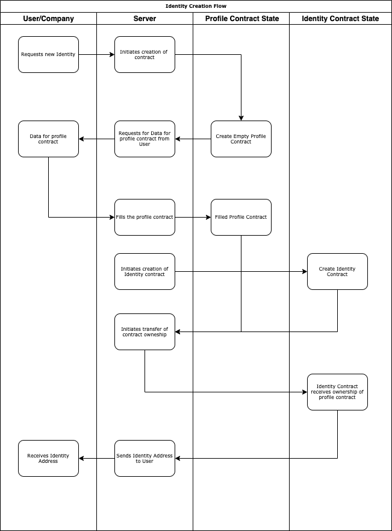
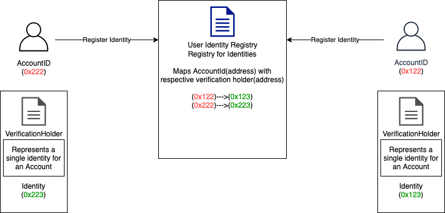

# Identities

Identities can be considered as virtual accounts for a user. Identities are basically contracts which are bound to a profile and controlled by an externally owned account. An account can have multiple identities and a single identity can also be controlled via multiple accounts.

## Create Identities

A user requests for an identity from the European Public Network. The European Public Network server prepares two contracts. One being an empty profile contract which is sent to the user to fill data while the second contract is an identity contract. Once the user has prepared the profile data and sent it to the server, the server writes the data to the profile contract and binds this to the identity contract. After the binding process the server removes itself from the owner and member role of the identity and the ownership is transferred to the user.

 

## Relation between Account and Identities

The following figure represents the relationship between a user and the identities. A user has his private keys off-chain which he uses to access his account on chain. The on-chain account owns multiple identities which have been created via the identity creation flow described in the previous section. As mentioned before multiple accounts can also control a single identity. This is done by giving other accounts [permissions](/docs/developers/concepts/smart-contract-permissioning.html) to the identity. These identities are used on the European Public Network as the actors for performing transactions.

Furthermore, The identities for each account are available in an identity registry. Each identity is mapped to it's respective account.

## Transactions using Identities

Recall that the identity contract is linked with the profile contract. As depicted in the figure the verification holder represents a single identity for an account and the identity registry maps the identity with its respective account. When performing a transaction using an identitiy the transaction is created by the identity itself but the transaction is signed and executed using the account that owns the identity. Using this approach the transaction is performed via the identity on the chain.

